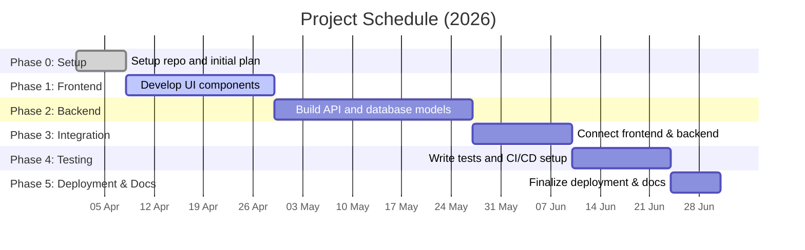

# Financial Advisor — Project Roadmap & README

## Executive Summary
This document provides a detailed phased project plan and roadmap for a **Financial Advisor** web application, as per the given project synopsis. It lists all assumed and required features (noting any unspecified items), recommends a technology stack, and breaks development into Phases 0 through 5 (setup, frontend, backend, integration, testing/deployment, documentation/demo). Each phase includes objectives, deliverables, time estimates (low/med/high), required skills, the GitHub repo structure, branch strategy, commit/PR conventions, and a task checklist. We include beginner-friendly code snippets (React component, Express endpoint, MongoDB schema, JWT auth), example GitHub Actions workflows for CI/CD (with a placeholder for Antigravity deploy), a Mermaid Gantt chart timeline, a development flowchart, an evaluation rubric, and a demo checklist. Learning resources and troubleshooting tips are also provided. Unspecified details from the synopsis are marked [Unspecified]. This README is structured as a comprehensive guide for a B.Tech student.

## Assumed & Required Features
- **User Accounts & Authentication:** User signup/login system (JWT-based). *[Assumed: not detailed in synopsis]*  
- **Income Tracking:** Input and store user income details (explicit in synopsis).  
- **Expense Tracking:** Record daily expenses with categories (explicit).  
- **Ghost Expense Detection:** Identify small recurring or forgotten transactions (explicit).  
- **Unnecessary Spending Detection:** Flag expenditures exceeding budget or patterns (explicit).  
- **Budget Management:** Set spending limits by category and monitor usage (explicit).  
- **Monthly Reports:** Summarize income, expenses, and savings each month (explicit).  
- **Financial Advice Engine:** Provide personalized tips based on spending behavior (explicit).  
- **ITR Learning Module:** Educational content on income tax filing and deductions (explicit).  
- **Responsive UI:** Mobile-friendly web interface. *[Assumed: needed for usability]*  
- **Data Persistence:** Store all user data in a database (implied requirement).  
- **Security & Privacy:** Protect user data (HTTPS, input validation). *[Unspecified]*  
- **Charts/Analytics:** Visual charts for reports (not specified, but typical). *[Unspecified]*  
- **CI/CD Pipeline:** Automated tests/build and deploy (recommended for quality). *[Assumed: best practice]*  

*[Unspecified]* items are not described in the synopsis. For example, exact UI design or charts are not given, so choose basic implementations (e.g. simple tables or open-source chart libraries). 

## Recommended Tech Stack
For clarity and ease of learning, a JavaScript-based MERN stack is recommended:
- **Frontend:** **React** – A popular component-based JS library for building UIs【11†L10-L13】. React’s declarative model and large community make it beginner-friendly. *Alternatives:* Angular, Vue.  
- **Backend:** **Node.js** with **Express.js** – A non-blocking JS runtime【28†L231-L239】 and minimalist web framework【28†L333-L342】. Together they allow using JavaScript for server-side logic. *Alternatives:* Python (Django/Flask), Ruby on Rails, Java (Spring Boot).  
- **Database:** **MongoDB** – A NoSQL document database (stores JSON-like documents)【15†L366-L370】. It handles flexible schemas well (useful for evolving requirements). *Alternatives:* PostgreSQL, MySQL (relational databases).  
- **Authentication:** **JWT (JSON Web Tokens)** – Standard for stateless auth. Use libraries like Passport.js (Express) and store tokens client-side. *Alternatives:* OAuth providers (Auth0), Firebase Auth.  
- **CI/CD & Hosting:** **GitHub Actions + Antigravity** – GitHub Actions for automated build/test pipelines【6†L419-L427】. (Antigravity is the given hosting platform; deployment commands are [Unspecified], so we include a placeholder.) *Alternatives:* Travis CI, CircleCI for CI; Heroku, Vercel, AWS, Netlify for hosting.  
- **Dev Tools:** **VS Code** – A lightweight, widely used code editor (preferred by ~74% of developers【27†L2315-L2323】). Use Git for version control, and Postman/Insomnia for API testing.

| Layer           | Recommended                        | Rationale                                         | Alternatives                  |
|-----------------|------------------------------------|---------------------------------------------------|-------------------------------|
| Frontend UI     | React【11†L10-L13】                | Component-based; popular and well-supported.      | Angular, Vue.js               |
| Backend/API     | Node.js + Express【28†L231-L239】【28†L333-L342】 | Single-language stack; event-driven performance. | Django/Flask (Python); Rails  |
| Database        | MongoDB【15†L366-L370】            | Document DB; flexible schema (JSON storage).      | PostgreSQL, MySQL (SQL DBs)   |
| Authentication  | JWT tokens (via Passport.js, etc.) | Stateless, works well with single-page apps.      | OAuth2 providers, session-based |
| CI/CD & Hosting | GitHub Actions + Antigravity       | Integrated workflows; free with GitHub accounts【6†L419-L427】. | Travis CI, CircleCI; Heroku, Netlify |
| Dev Tools       | VS Code【27†L2315-L2323】, Git     | Industry-standard tools; strong community support.| WebStorm, Atom, Sublime       |

## Phase 0: Setup & Planning
- **Objective:** Establish the project foundation.  
- **Deliverables:** Initialized GitHub repo with README, `.gitignore`, and basic folder structure; initial project plan (this roadmap).  
- **Estimated Time:** Low–Medium (~1–2 weeks).  
- **Skills:** Basic Git/GitHub usage, Node/NPM, documentation.  
- **Repo Structure & Branch Strategy:** Create the GitHub repo `financial-advisor-app`. Use this layout:

  ```bash
  financial-advisor-app/
  ├── frontend/         # React app
  │   ├── src/
  │   └── package.json
  ├── backend/          # Node/Express server
  │   ├── src/
  │   └── package.json
  ├── .github/
  │   └── workflows/    # CI/CD YAML files
  ├── README.md
  └── .gitignore
  ```

  - **Branches:** Use `main` (stable releases) and `develop` (integration). Feature branches are named `feature/<name>`. E.g.:
    ```bash
    git checkout -b feature/frontend-login develop
    git checkout -b feature/backend-expense-api develop
    ```
  - Merge features into `develop`; when stable, merge `develop` into `main` and tag releases.
- **Commit/PR Conventions:** Write clear commit messages (imperative tense, e.g. “Add login form”). Use prefixes like `feat:`, `fix:` if desired. Open Pull Requests for all merges (target `develop` or `main`) with descriptive titles (e.g. “feat: implement login API”).
- **Tasks Checklist:**  
  - [ ] Create GitHub repo and add license/README template.  
  - [ ] Set up `.gitignore` (Node and React defaults).  
  - [ ] Initialize projects: run `npm init` in `/backend` and `npx create-react-app frontend`.  
  - [ ] Install core dependencies: Express in backend, React libraries in frontend.  
  - [ ] Create initial folders/files (e.g. `backend/src/index.js`, `frontend/src/App.js`).  
  - [ ] Create `develop` branch and sample feature branches.  
  - [ ] Write basic `README.md` instructions for cloning and setup.  
  - [ ] Draft a list of UI pages and API routes to be implemented in later phases.  

## Phase 1: Frontend Development
- **Objective:** Build the user interface (static prototype).  
- **Deliverables:** A React app with pages/components (login, dashboard, forms) and navigation (without real data integration).  
- **Estimated Time:** High (~3–4 weeks).  
- **Skills:** HTML/CSS, React (JSX, hooks, state), React Router (for multiple pages).  
- **Repo & Branch:** Continue using the same repo. Create branches like `feature/frontend-homepage`, `feature/frontend-report-page`. Merge into `develop`.  
- **GitHub Structure:** In `/frontend`, structure like:
  ```bash
  frontend/
  ├── src/
  │   ├── components/   # Reusable UI components
  │   ├── pages/        # React pages (LoginPage, Dashboard, etc.)
  │   ├── App.js
  │   └── index.js
  └── package.json
  ```
- **Tasks Checklist:**  
  - [ ] Scaffold React app if not already.  
  - [ ] Create core pages/components:
    - Login/Register form (`LoginPage`, `RegisterPage`).  
    - `DashboardPage` (summary info).  
    - `ExpenseForm`, `IncomeForm` components to enter data.  
    - `BudgetPage` (set/view budgets).  
    - `ReportsPage` (display monthly totals).  
    - `ITRModulePage` (static tax info).  
  - [ ] Implement routing (e.g. using React Router): public routes (login/register) and protected routes (dashboard, reports).  
  - [ ] Build a navigation bar or sidebar for logged-in users.  
  - [ ] Use CSS or a UI library (Bootstrap/Material-UI) for layout; ensure responsiveness (mobile-friendly).  
  - [ ] Populate pages with placeholder/static data or sample JSON to test layout.  
  - [ ] Commit frequently with meaningful messages. Example branch merge message: `feat: add expense form component`.  

## Phase 2: Backend Development
- **Objective:** Implement the server API and database models.  
- **Deliverables:** Node/Express server with REST endpoints and MongoDB models.  
- **Estimated Time:** High (~3–4 weeks).  
- **Skills:** Node.js, Express routing, MongoDB (Mongoose schemas), JWT auth.  
- **Repo & Branch:** Use the same repo. Branch names like `feature/backend-auth`, `feature/backend-expenses`. Merge into `develop`.  
- **GitHub Structure:** In `/backend`, structure like:
  ```bash
  backend/
  ├── src/
  │   ├── models/      # Mongoose schema files (User.js, Expense.js, etc.)
  │   ├── routes/      # Express routes (auth.js, expenses.js, etc.)
  │   ├── middleware/  # Auth middleware (e.g. verify JWT)
  │   └── index.js     # Entry point
  └── package.json
  ```
- **Tasks Checklist:**  
  - [ ] Set up Express server in `backend/src/index.js` (listen on a port).  
  - [ ] Install and configure MongoDB connection (URI from `.env`; use `mongoose.connect`).  
  - [ ] Define Mongoose schemas: 
    - `User` (fields: name, email, passwordHash).  
    - `Expense` (amount, category, date, userId).  
    - `Income` (amount, source, date, userId).  
    - `Budget` (category, limit, userId).  
  - [ ] Create Express routes and controllers:
    - **Auth routes:** `POST /api/auth/register`, `POST /api/auth/login` (hash password with bcryptjs, issue JWT on login).  
    - **Expense routes:** `GET/POST/PUT/DELETE /api/expenses` (secured by auth).  
    - **Income routes:** similar under `/api/incomes`.  
    - **Budget routes:** `GET/POST/PUT/DELETE /api/budgets`.  
    - **Report/Analysis:** optional route `/api/reports` to aggregate user data (if time allows).  
  - [ ] Implement JWT authentication middleware (verify token, attach `req.userId`). Protect routes (Express).  
  - [ ] [Optional] Ghost/unnecessary expense logic: simple check (e.g. flag expenses < $X/month) or leave as TODO. Mark complex analysis as [Unspecified] for now.  
  - [ ] Test routes with Postman or curl. Ensure CORS is enabled (`app.use(cors())`).  
  - [ ] Commit code with clear messages (e.g. `feat: create expense model and routes`).  

## Phase 3: Integration (Frontend ↔ Backend)
- **Objective:** Connect the React frontend with the Express backend to form a working application.  
- **Deliverables:** Full-stack app where UI calls API endpoints and updates dynamically.  
- **Estimated Time:** Medium (~2–3 weeks).  
- **Skills:** Axios or Fetch for HTTP, handling JWT in client, CORS, React state management.  
- **Repo & Branch:** Same repo. Branch names like `feature/integrate-login`, `feature/integrate-expense`. Merge into `develop`.  
- **Tasks Checklist:**  
  - [ ] In Express, ensure CORS is enabled (`npm install cors` and `app.use(cors())`).  
  - [ ] In React, install `axios` (or use `fetch`).  
  - [ ] **Auth Flow:** Update Login/Register forms to send data to backend (`/api/auth/login`, `/api/auth/register`).  
    - On successful login, store the returned JWT (e.g. in `localStorage`) and user info in React state or context.  
    - Attach JWT to future requests (`axios.defaults.headers.common['Authorization'] = 'Bearer ' + token`).  
  - [ ] **Protected Routes:** Show login page if no valid token. Ensure pages like Dashboard, Reports require authentication.  
  - [ ] **Data Calls:** Update forms/components to use the API:
    - Example: `axios.post('/api/expenses', { amount, category }, { headers: { Authorization: token } })`.  
  - [ ] **Fetch Data:** On mount of pages like Reports or Dashboard, `GET` data from API and display in UI (e.g. list expenses, totals).  
  - [ ] **Budget Integration:** Use API to `GET/POST` budgets and show alerts if budgets are exceeded.  
  - [ ] **Advice Engine:** If built, fetch suggestions from `/api/reports` or compute on client side.  
  - [ ] **Error Handling:** Display messages for API errors (e.g. incorrect login).  
  - [ ] Test full workflow: register, login, add income/expense, view updated report.  
  - [ ] Update README with instructions for running both server and client (e.g. concurrently using `concurrently` package).  

## Phase 4: Testing & Deployment
- **Objective:** Ensure code quality and automate testing and deployment.  
- **Deliverables:** Test suites for key functionality, CI pipeline, and deployed app on Antigravity.  
- **Estimated Time:** Medium (~2–3 weeks).  
- **Skills:** Jest or Mocha for tests, GitHub Actions, environment setup.  
- **Repo & Branch:** Same repo. Branch names like `feature/test-backend`, `feature/ci-setup`. Merge into `main` (and `develop`) when ready.  
- **Tasks Checklist:**  
  - [ ] **Write Tests:** 
    - Backend: Use Jest/Mocha + Supertest to test API endpoints (e.g. auth, expense routes).  
    - Frontend: Use React Testing Library to test components (e.g. login form renders, API call mocks).  
  - [ ] **Lint & Format:** (Optional) Configure ESLint/Prettier.  
  - [ ] **GitHub Actions Setup:** Create `.github/workflows/ci.yml`. Include steps (checkout code, setup Node, install, test)【6†L419-L427】. For example:
    ```yaml
    name: Build & Test
    on: [push, pull_request]
    jobs:
      test:
        runs-on: ubuntu-latest
        strategy:
          matrix:
            node-version: [18.x]
        steps:
          - uses: actions/checkout@v5
          - uses: actions/setup-node@v4
            with: node-version: ${{ matrix.node-version }}
          - run: npm ci
          - run: npm test
    ```
  - [ ] **Deployment Workflow:** Extend CI to deploy on push to `main`. Example (placeholder):
    ```yaml
    deploy:
      needs: test
      runs-on: ubuntu-latest
      if: github.ref == 'refs/heads/main'
      steps:
        - uses: actions/checkout@v5
        - uses: actions/setup-node@v4
          with: node-version: '18.x'
        - run: npm ci
        - run: npm run build
        - name: Deploy to Antigravity [Unspecified]
          run: |
            # e.g., antigravity deploy commands or API calls
            curl -X POST https://api.antigravity.cloud/deploy \
              -H "Authorization: Bearer ${{ secrets.ANTIGRAVITY_TOKEN }}" \
              -F project=financial-advisor-app
    ```
    *Replace with Antigravity’s actual deploy instructions (currently [Unspecified]).*  
  - [ ] **Environment Variables:** Store secrets in GitHub (`Settings > Secrets`): `MONGODB_URI`, `JWT_SECRET`, `ANTIGRAVITY_TOKEN`, etc. Access via `process.env` in Node.  
  - [ ] **Verify Deployment:** After merging to `main`, confirm the app is live on Antigravity (visit the URL).  

## Phase 5: Documentation & Demo
- **Objective:** Finalize documentation and prepare demonstration materials.  
- **Deliverables:** Polished `README.md`, inline code comments, demo checklist, and evaluation rubric. Release/tag version.  
- **Estimated Time:** Low (~1 week).  
- **Skills:** Technical writing, presentation preparation.  
- **Repo & Branch:** Finalize on `main`, create release tag (e.g. `v1.0`).  
- **Tasks Checklist:**  
  - [ ] **Finalize README:** Summarize features, setup steps, tech stack (this roadmap can be shortened for the README).  
  - [ ] **Code Comments:** Ensure complex sections (e.g. JWT auth logic) have explanatory comments.  
  - [ ] **Demo Prep:** Prepare slides or script covering all features (login, add data, view reports).  
  - [ ] **Evaluation Materials:** Include the rubric table and demo checklist (below) in docs.  
  - [ ] **Release:** Tag the final commit (`git tag v1.0`) and push tags.  

## Code Snippets (Examples)

/** React Component (ExpenseForm) **/  
```jsx
// frontend/src/components/ExpenseForm.js
import React, { useState } from 'react';

function ExpenseForm({ onAddExpense }) {
  // State hooks for form inputs
  const [amount, setAmount] = useState('');
  const [category, setCategory] = useState('');

  const handleSubmit = (e) => {
    e.preventDefault();
    // Prepare expense data
    const expenseData = {
      amount: parseFloat(amount),
      category: category,
      date: new Date()
    };
    // Send data to parent or API
    onAddExpense(expenseData);
    // Reset form
    setAmount('');
    setCategory('');
  };

  return (
    <form onSubmit={handleSubmit}>
      <input
        type="number"
        value={amount}
        placeholder="Amount"
        onChange={e => setAmount(e.target.value)}
      />
      <select value={category} onChange={e => setCategory(e.target.value)}>
        <option value="">Select Category</option>
        <option value="Food">Food</option>
        <option value="Transport">Transport</option>
        <option value="Utilities">Utilities</option>
      </select>
      <button type="submit">Add Expense</button>
    </form>
  );
}

export default ExpenseForm;
```

/** Express REST Endpoint **/  
```js
// backend/src/routes/expenses.js
const express = require('express');
const router = express.Router();
const Expense = require('../models/Expense');
const authMiddleware = require('../middleware/auth');

// GET /api/expenses - list all expenses for the logged-in user
router.get('/', authMiddleware, async (req, res) => {
  try {
    const expenses = await Expense.find({ userId: req.userId });
    res.json(expenses);
  } catch (error) {
    res.status(500).send('Server error');
  }
});

module.exports = router;
```

/** Mongoose Schema **/  
```js
// backend/src/models/Expense.js
const mongoose = require('mongoose');

const ExpenseSchema = new mongoose.Schema({
  userId: { type: mongoose.Schema.Types.ObjectId, ref: 'User', required: true },
  amount: { type: Number, required: true },
  category: { type: String, required: true },
  date: { type: Date, default: Date.now }
});

module.exports = mongoose.model('Expense', ExpenseSchema);
```

/** JWT Authentication (Login Route & Middleware) **/  
```js
// backend/src/routes/auth.js
const express = require('express');
const jwt = require('jsonwebtoken');
const bcrypt = require('bcryptjs');
const User = require('../models/User');
const router = express.Router();

// POST /api/auth/login
router.post('/login', async (req, res) => {
  const { email, password } = req.body;
  // Find user by email
  const user = await User.findOne({ email });
  if (!user) return res.status(404).json({ msg: 'User not found' });
  // Check password
  const isMatch = await bcrypt.compare(password, user.passwordHash);
  if (!isMatch) return res.status(400).json({ msg: 'Invalid credentials' });
  // Sign JWT
  const token = jwt.sign({ userId: user.id }, process.env.JWT_SECRET);
  res.json({ token });
});

// Auth middleware to protect routes
function authMiddleware(req, res, next) {
  const authHeader = req.header('Authorization');
  if (!authHeader) return res.status(401).json({ msg: 'No token' });
  const token = authHeader.split(' ')[1];
  try {
    const decoded = jwt.verify(token, process.env.JWT_SECRET);
    req.userId = decoded.userId;
    next();
  } catch {
    res.status(401).json({ msg: 'Invalid token' });
  }
}

module.exports = { router, authMiddleware };
```

## CI/CD: GitHub Actions Examples
Example `.github/workflows/ci-cd.yml`:

```yaml
name: CI/CD Pipeline
on:
  push:
    branches: [ main ]
  pull_request:
    branches: [ main ]

jobs:
  test:
    runs-on: ubuntu-latest
    strategy:
      matrix: { node-version: ['18.x'] }
    steps:
      - uses: actions/checkout@v5
      - uses: actions/setup-node@v4
        with: node-version: ${{ matrix.node-version }}
      - run: npm ci
      - run: npm test

  deploy:
    needs: test
    runs-on: ubuntu-latest
    if: github.ref == 'refs/heads/main'
    steps:
      - uses: actions/checkout@v5
      - uses: actions/setup-node@v4
        with: node-version: '18.x'
      - run: npm ci
      - run: npm run build
      - name: Deploy to Antigravity [Unspecified]
        env:
          ANTIGRAVITY_TOKEN: ${{ secrets.ANTIGRAVITY_TOKEN }}
        run: |
          # Placeholder for Antigravity deploy commands
          curl -X POST https://api.antigravity.cloud/deploy \
            -H "Authorization: Bearer $ANTIGRAVITY_TOKEN" \
            -F project=financial-advisor-app
```

The above workflow runs tests on each push/PR, and upon a successful merge to `main`, builds and deploys to Antigravity (using an example curl command; replace with the real deploy process when known)【6†L419-L427】.

## Project Timeline (Gantt Chart)


## Development Workflow Diagram
```mermaid
flowchart LR
  A[Developer] --> B(Feature Branch)
  B --> C(Pull Request to Develop)
  C --> D[Develop Branch]
  D --> E(Pull Request to Main)
  E --> F[Main Branch (Release)]
  F --> G[CI/CD: Build/Test/Deploy]
```

This diagram shows feature branches merging into `develop`, and then into `main` for releases, with GitHub Actions handling CI/CD.

## Evaluation Rubric & Demo Checklist

| Criteria           | Excellent (4–5)                              | Good (2–3)                       | Needs Improvement (0–1)        |
|--------------------|----------------------------------------------|----------------------------------|--------------------------------|
| **Functionality**  | All features implemented; works flawlessly.  | Most features present; minor bugs. | Many missing features or bugs. |
| **UI/UX**          | Responsive, intuitive, polished interface.   | Functional UI; some usability issues. | Cluttered or incomplete UI.    |
| **Code Quality**   | Clean, well-organized code with comments.    | Mostly clear code; some comments.    | Disorganized or poorly documented. |
| **Testing & CI**   | Comprehensive tests; CI pipeline passing.    | Basic tests; CI mostly green.     | Little or no testing; failures. |
| **Documentation**  | Clear README and inline comments.           | Some documentation provided.    | Lacks clear documentation.     |
| **Demonstration**  | All demo features work (see checklist).      | Most demo features work.        | Many demo features missing.    |

**Demo Checklist:**

- [ ] App is deployed and accessible (Antigravity URL).  
- [ ] User registration and login work correctly.  
- [ ] Income and expense entries can be added, viewed, edited, deleted.  
- [ ] Ghost/unnecessary expenses are detected (show example).  
- [ ] Monthly report displays income vs expenses vs savings.  
- [ ] Budgets can be set; budget overruns are indicated.  
- [ ] Financial advice suggestions appear based on data.  
- [ ] ITR learning section displays tax guidance info.  
- [ ] UI is responsive (demonstrate on mobile/resized window).  
- [ ] GitHub Actions CI run shows tests passing.  
- [ ] Follows GitHub branching/PR workflow.

## Learning Resources & Troubleshooting

- **Official Docs:** 
  - React: [React Docs](https://react.dev/)【11†L10-L13】 (JSX, components).  
  - Node.js: [Node.js Introduction](https://nodejs.org/en/docs/guides/)【28†L231-L239】.  
  - Express: [Express Docs](https://expressjs.com/)【28†L333-L342】.  
  - MongoDB: [MongoDB Basics](https://www.mongodb.com/basics)【15†L366-L370】.  
  - JWT: [jwt.io](https://jwt.io/) (tutorials).  
  - GitHub Actions: [GitHub Actions Docs](https://docs.github.com/actions)【6†L419-L427】.
- **Tutorials:** freeCodeCamp, MDN Web Docs, and YouTube (search “MERN tutorial”) for step-by-step guides.
- **Troubleshooting Tips:** 
  - Read error messages carefully; they often indicate the issue.  
  - Use browser DevTools (Console/Network) to debug frontend/API calls.  
  - Verify environment variables (MONGODB_URI, JWT_SECRET) are set in `.env` and GitHub secrets.  
  - For CORS errors, ensure `app.use(cors())` is enabled on the server.  
  - If Git errors occur, ensure you have the latest code (`git pull`) before creating branches.  
  - Look up stack traces or error text online (e.g. StackOverflow) for common fixes.  

This README is intended to be comprehensive and user-friendly for beginners. It provides a clear roadmap, code examples, and checklists to guide development from setup to deployment. 

```{r comment="No literal code output"} ```

